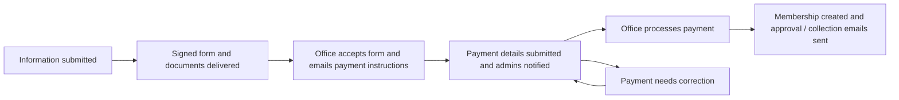

# WCCIK membership workflow

Updated: 9 October 2026.

Source: [User journey v3, 21 April 2026](<User journey v3- 21 Apr 2026.pdf>), with the client's latest instructions taking precedence: new applicants pay only after the office accepts their physical form and documents; collection is within seven days after payment processing.

## New membership

1. Sign in with the email verification code and complete the information form. Payment uploads, payment dates, and payment methods are rejected at this stage.
2. Submit the information. Download the filled PDF, print, sign and stamp it, and deliver it with the supporting documents within ten days. The acknowledgement email contains the filled PDF.
3. The administrator records receipt of the physical form and supporting documents, reviews eligibility, and selects **Accept form and request payment**. The action requires the approved fee and bank/cheque/pay-order instructions. No bank account or fee is invented by the system.
4. Acceptance queues the applicant's instructions email and opens payment submission on the dashboard. Membership is still pending. The email states that the certificate will be ready for collection within seven days after payment is processed.
5. The applicant submits a receipt, payment date, and payment method. Cheque and pay-order receipts can also be recorded by an administrator after acceptance. Every user authorised to access Nova receives a Nova notification and a queued email linking to the application.
6. An administrator reviews the payment and selects **Process payment and create membership**. The administrator confirms the processing/realization date, including valid backdated dates, and a future membership expiry. Payment details can be corrected in the application first.
7. Verified payment creates and links the member record, issues the new membership number, and queues two applicant emails: membership approval and certificate collection instructions. Processing is atomic and repeated processing does not create another member or send duplicate final emails.

## Renewal

The supplied PDF permits an optional payment receipt on the renewal form, so that option remains available. Its date and method are required if a receipt is attached. Renewal forms and documents still need office acceptance before payment can be processed into an active membership. Acceptance alerts administrators when complete payment was already supplied, and the instructions email explicitly tells the applicant not to pay again.

For a renewal without payment, the accepted-form dashboard supports later submission just like a new membership. Final processing updates the existing member's reviewed information and expiry and preserves the membership number.

The question of removing early renewal payment as well has been raised separately; the current implementation preserves the PDF's distinction.

## Administrator actions

| Action | Preconditions and result |
|---|---|
| Accept form and request payment | Signed form and supporting documents received; required payment instructions entered; accepts information and opens payment submission |
| Process payment and create membership | Form accepted; instructions recorded; receipt, date and method available; verified payment activates membership and sends both final emails |
| Resend payment instructions | Available only after acceptance; resends the stored instructions without accepting a form or creating membership |
| Reject application | Rejects a pending application and sends the reason |

The payment-processing action can also reject payment and request a corrected receipt. A rejected payment keeps form acceptance, while application rejection closes the journey.

## Corrections and existing records

- Applicants can edit drafts but cannot edit submitted information.
- Admin information corrections reset office receipt checks and form acceptance, close payment submission, and require review again.
- Replacing a receipt or amending payment date/method resets payment verification and processing metadata while preserving form acceptance.
- Completed application records remain protected from editing.
- Existing receipts are retained. An older acceptance without stored payment instructions needs the acceptance action to supply instructions before payment can proceed.
- Existing assigned application identifiers are retained; new applications receive membership numbers only when membership is created. Renewals continue using the existing member number.

## Setup and operational notes

Run the `2026_10_09_000000_add_staged_payment_workflow_to_applications` migration. It adds acceptance payment instructions, payment-submission tracking, and the processing date, and installs the new email templates without overwriting customised templates.

Email jobs use the existing Laravel queue connection and retry failed sends up to three times. A queue worker is required when the configured connection is asynchronous. Nova notifications are stored independently of email delivery. Recipient selection uses the existing `viewNova` authorisation gate.

Seven days is the collection commitment in the emails, not an automatic certificate-production or collection-booking system. The PDF's scheduled document reminders, renewal reminders, holiday calendar, and working-day deadline calculations remain separate automation work. The certificate emails do not invent an exact ready date or claim that those calculations already exist.
